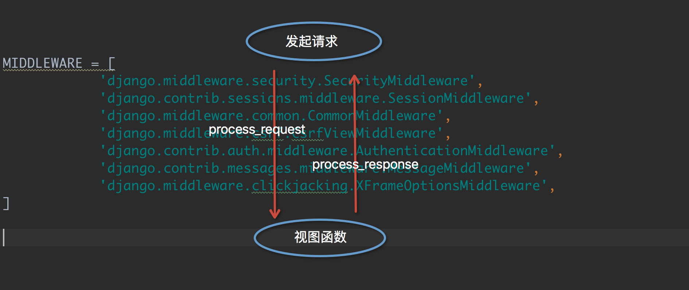
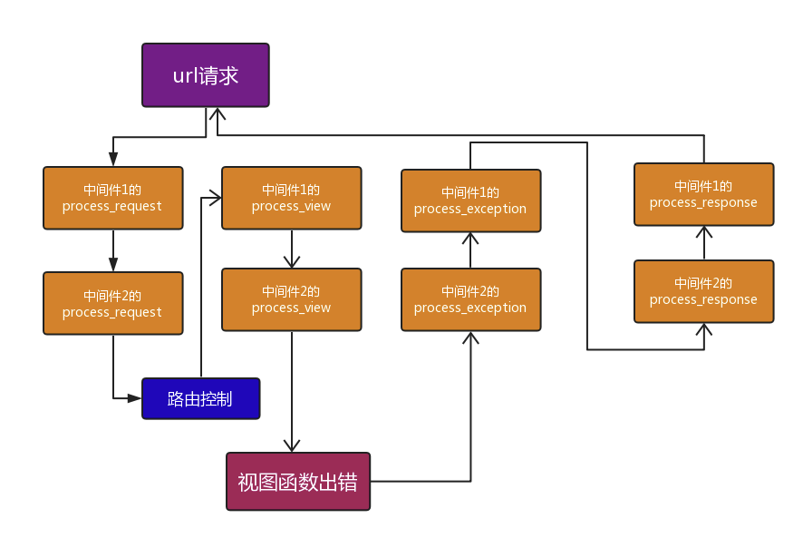

# 中间件

## 定义

中间件，是介于 request 与 response 处理之间的一道处理过程，位于 web 服务端与 url 路由层之间。

把请求比喻为送信人，送信人需要将信(数据)送到处理中心，但是处理中心门前有门卫，负责对数据进行检查或者处理。

## 作用

如果你想要修改请求，例如被传到 view 中的 HttpRequest 对象，或者修改 view 返回的 HttpResponse 对象，都可以通过中间来实现

请求进来后，是通过 middleware 自上而下，通过反射找到类，用 for 循环来执行。

每一个中间件都有具体的功能

## 预留函数

\_\_init\_\_：服务器响应第一个请求的时候调用

process_request:是在产生 request 对象，进行 url 匹配之前调用

process_view:是 url 匹配之后，调用视图函数之前

process_response:视图函数调用之后，内容返回给浏览器之前

process_exception:视图函数出现异常，会调用这个函数

如果注册的多个中间件类中包含 process_exception 函数的时候，调用的的顺序跟注册的顺序相反的

## 自定义

中间件可以定义 5 个方法：

```python
1、process_request(self,request)

2、process_view(self, request, callback, callback_args, callback_kwargs)

3、process_template_response(self,request,response)

4、process_exception(self, request, exception)

5、process_response(self, request, response)
```

以上方法的返回值可以是 None 或一个 HttpResponse 对象

- 如果是 None，则继续按照 django 定义的规则向后继续执行
- 如果是 HttpResponse 对象，则直接将该对象返回给用户



### 1. process_request 和 process_response

- 中间件的 process_request 方法是在执行视图函数之前执行的
- 当配置多个中间件时，会按照 Middleware 中的注册顺序，也就是列表的索引值，从前到后依次执行
- 不同中间件之间传递的 request 都是同一个对象
- 多个中间件中的 process_response 方法是按照 MIDDLEWARE 中的注册顺序倒序执行的，也就是说第一个中间件的 process_request 方法首先执行，而它的 process_response 方法最后执行，最后一个中间件的 process_request 方法最后一个执行，它的 process_response 方法是最先执行

### 2. process_view

process_view(self, request, view_func, view_args, view_kwargs)

- request 是 HttpRequest 对象
- view_func 是 Django 即将使用的视图函数（它是实际的函数对象，而不是函数的名称作为字符串。）
- view_args 是将传递给视图的位置参数的列表（无名分组分过来的值）
- view\_\_kwargs 是将传递给视图的关键字参数的字典（有名分组分过来的值）
- view_args 和 view_kwargs 都不包含第一个视图参数（request）

Django 会再调用视图函数之前调用 process_view 方法

它返回 None 或一个 HttpResponse 对象

- 如果返回 None，Django 将继续处理这个请求，执行任何其他中间件的 process_view 方法，然后在执行相应的视图
- 返回 HTTPResponse 对象，Django 不会调用适当的视图函数。他将执行中间件的 process_response 方法并将应用到该 HttpResponse 并返回结果

### 3. process_exception(self, request, exception)

函数有两个参数：

- 一个 HttpRequest 对象
- 一个 exception 是视图函数异常产生的 Exception 对象

这个方法只有在视图函数中出现异常了才执行，它返回的值是一个 None 或 HttpResponse 对象

- HttpResponse 对象，Django 将调用模板和中间件中的 process_response 方法，并返回给浏览器，否则将默认处理异常
- None，则交给下一个中间件的 process_exception 方法来处理异常。

它的执行顺序也是按中间注册顺序的倒序执行

### 4. process_template_response(self, request, response)

该方法对视图函数返回值有要求，必须是有一个含有 render 方法类的对象，才会执行此方法



## 使用场景

- 做 IP 访问频率限制
- URL 访问过滤

## 小结

1. 新建 middleware.py
2. 定义中间类
3. 注册中间件类：在 settings 的 MIDDLEWARE 中添加中间件

## 参考链接

[https://blog.csdn.net/ifubing/article/details/100676392](https://blog.csdn.net/ifubing/article/details/100676392)

[https://www.cnblogs.com/abdm-989/p/11972528.html](https://www.cnblogs.com/abdm-989/p/11972528.html)

[https://www.cnblogs.com/sui776265233/p/9664642.html](https://www.cnblogs.com/sui776265233/p/9664642.html)
