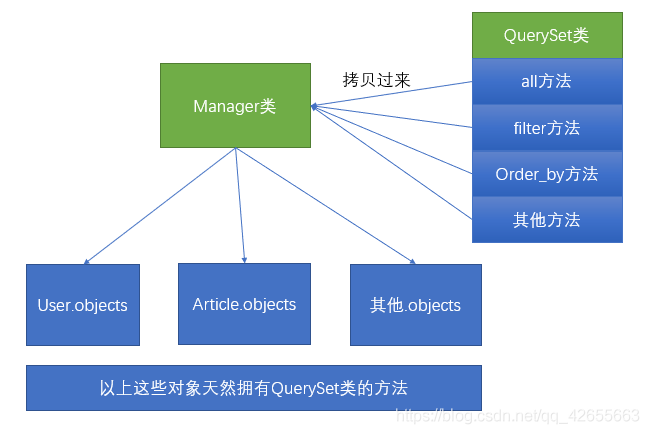

# QuerySet 浅析

## QuerySet 源码浅析

模型.objects：

```python
from django.http import HttpResponse
from .models import Book
def index(request):
    print(type(Book.objects))
    return HttpResponse("index")
```

控制台打印信息

```python
<class 'django.db.models.Manager'>
```

也就是说对象是`django.db.models.manager.Manager`的对象，Ctrl + B 进入路径可以看到

```python
class Manager(BaseManager.from_queryset(QuerySet)):
    pass
```

这个类是一个空壳类，它上面的所有方法都是从`BaseManager`这个类上`from_queryset`方法上拷贝过来的。看懂了`from_queryset`的返回，也就看懂了`QuerySet`，`objects`也就知道该如何使用。

`from_queryset`调用了`QuerySet`这个类

```python
    @classmethod
    def from_queryset(cls, queryset_class, class_name=None):
        if class_name is None:
            class_name = '%sFrom%s' % (cls.__name__, queryset_class.__name__)
        class_dict = {
            '_queryset_class': queryset_class,
        }
        class_dict.update(cls._get_queryset_methods(queryset_class))
        return type(class_name, (cls,), class_dict)
```

可以看到，`class_name`默认为空，`cls.__name__` = `BaseManager`，`queryset_class.__name__`为`QuerySet`，则拼接后的`class_name`= "BaseManagerFromQuerySet"。

这里，我们只要再了解下`_get_queryset_methods`这个方法就可以知道 Query Set 是怎么“跑到”Manager 类中了

```python
    @classmethod
    def _get_queryset_methods(cls, queryset_class):
        def create_method(name, method):
            def manager_method(self, *args, **kwargs):
                return getattr(self.get_queryset(), name)(*args, **kwargs)
            manager_method.__name__ = method.__name__
            manager_method.__doc__ = method.__doc__
            return manager_method

        new_methods = {}
        # Refs http://bugs.python.org/issue1785.
        predicate = inspect.isfunction if six.PY3 else inspect.ismethod
        for name, method in inspect.getmembers(queryset_class, predicate=predicate):
            # Only copy missing methods.
            if hasattr(cls, name):
                continue
            # Only copy public methods or methods with the attribute `queryset_only=False`.
            queryset_only = getattr(method, 'queryset_only', None)
            if queryset_only or (queryset_only is None and name.startswith('_')):
                continue
            # Copy the method onto the manager.
            new_methods[name] = create_method(name, method)
        return new_methods
```

其中函数`create_method`创建方法，`queryset_class`是`_get_queryset_methods`传入的参数，也就是`QuerySet`，getmembers 会从`QuerySet`获取其所有的方法，进行过滤后，然后把遍历出来的方法存放到字典`new_methods`中，然后把`new_methods`返回，来更新到`class_dict`中，回到`from_queryset`函数，我们可以得到以下结论

```python
# type动态的时候创建类（class是静态地创建一个类）
# 第一个参数是用来指定创建的类的名字。创建的类名是：BaseManagerFromQuerySet
# 第二个参数是用来指定这个类的父类。
# 第三个参数是个字典，其中第一个键是用来指定这个类的一些属性，另一个键是用来指定这些类的方法
    return type(class_name, (cls,), class_dict)
```

`Manager`类与`QuerySet`类的关系如下图：



## QuerySet 特性

1. 可以切片使用，不支持负的索引：

```python
book_list=models.Book.objects.all()
print(book_list)   #<QuerySet [<Book: python>, <Book: go>]>
book_list[0:1]   #<QuerySet [<Book: python>]>
```

2. 可迭代：

```python
book_list=models.Book.objects.all()
 for obj in book_list:
　　　　print(obj.title,obj.price)
```

3. 惰性查询：

创建查询集不会带来任何数据库的访问,只有在迭代、切片、调用 len 函数、list 函数和进行判断时，才会真正运行这个查询。

```python
from django.db import connection
queryset=Book.objects.all() #此时只是创建了查询集query,并没有运行，因此并没有执行相应的sql语句,要真正从数据库获得数据，需要遍历queryset:
print(connection.queries)   #打印空列表，说明并没有转化为SQL语句去执行
for article in queryset:
    print(article.title)    # 对queryset进行了查询，sql语句执行
print(connection.queries)	#打印SQL语句
```

4. 缓存机制：

当遍历 queryset 时，所有匹配的记录会从数据库获取，然后转换成 Django 的 model。这些 model 会保存在 queryset 内置的 cache 中，如果再次遍历这个 queryset，将直接使用缓存中的结果

执行下列代码，queryset 执行两次，但 sql 只执行了一次；

```python
queryResult=models.Book.objects.all()
print([a.title for a in queryResult])
print([a.create_time for a in queryResult])
```

重复获取查询集对象中一个特定的索引需要每次都查询数据库;

```python
queryset = Entry.objects.all()
print queryset[5] # 访问数据库
print queryset[5] # 再次访问数据库
```

## QuerySet 方法介绍

**values**：用来指定在提取数据时，需要提取哪些字段。默认情况下会把表中所有的字段全部都提取出来，可以使用 values 来进行指定，并且使用了 values 方法后，提取出的 QuerySet 中的数据类型不是模型，而是在 values 方法中指定的字段和值形成的字典。

```python
books = Book.objects.values('id', 'name')
print(books)
# 列表中包含字典
# <QuerySet [{'id': 1, 'name': '三国演义'}, {'id': 2, 'name': '水浒传'}]>
```

**values_list**：类似于 values。只不过返回的 QuerySet 中，存储的不是字典，而是元组。

```python
books = Book.objects.values_list('id', 'name')
print(books)   # <QuerySet [(1, '三国演义'), (2, '水浒传'), (3, '西游记'), (4, '红楼梦')]>
```

**select_related**：在对 QuerySet 使用 select_related()函数后，Django 会获取相应外键对应的对象，从而在之后需要的时候不必再查询数据库了。

select_related() 接受可变长参数，每个参数是需要获取的外键（父表的内容）的字段名，以及外键的外键的字段名、外键的外键的外键…。若要选择外键的外键需要使用两个下划线“\_\_”来连接。

```python
person = Person.objects.select_related('living__province')
```

select_related() 也可以不加参数，这样表示要求 Django 尽可能深的 select_related。

```python
person = Person.objects.select_related()
```

select_related() 接受 depth 参数，depth 参数可以确定 select_related 的深度。Django 会递归遍历指定深度内的所有的 OneToOneField 和 ForeignKey。

```python
person = Person.objects.select_related(depth = d)
#d=1 相当于 select_related(‘hometown’,’living’)
#d=2 相当于 select_related(‘hometown__province’,’living__province’)
```

可以通过传入一个 None 来清空之前的 select_related。

**prefetch_related()**：这个方法和 select_related 非常的类似，就是在访问多个表中的数据的时候，减少查询的次数。这个方法是为了解决多对一和多对多的关系的查询问题。

```python
Province.objects.prefetch_related('city_set')
```

和 select_related()一样，prefetch_related()也支持深度查询。

可以通过传入一个 None 来清空之前的 prefetch_related。

**get_or_create**：根据某个条件进行查找，如果找到了那么就返回这条数据，如果没有查找到，那么就创建一个。这个方法的返回值是一个元组，元组的第一个参数 obj 是这个对象，第二个参数 created 是 boolen 类型，代表是否创建的。

```python
obj, created = Author.objects.get_or_create(name="xxx", age=11)
```

但是，如果有的必填字段未给出，当数据库中有这条数据时，可以正常返回，如果没有这条数据，在创建数据时就会报错。

**update_or_create**：根据某个条件进行更新，如果找到了那么就返回更新后的数据，如果没有查找到，那么就创建一个。这个方法的返回值是一个元组，元组的第一个参数 obj 是这个对象，第二个参数 created 是 boolen 类型，代表是否创建的。

```python
obj, created = Author.objects.update_or_create(name="xxx", age=11)
```

**exists**：判断某个条件的数据是否存在。如果要判断某个条件的元素是否存在，那么建议使用 exists，这比使用 count 或者直接判断 QuerySet 更有效得多。因为它是先从缓存中找，没有缓存再去查找数据库。

```python
Author.objects.filter(name__contains='xxx').exists()
```

**aggregate**：在执行聚合函数的时候，是对 QuerySet 整个对象的某个属性汇总，在汇总时不会使用该模型的主键进行 group by 进行分组，得到的是一个结果字典。同时，该方法支持聚合关联表(如使用 ForeignKey)中的字段，在聚合连表中字段时，传递该字段的方式与查询连表时传递字段的方式相同，会使用到"\_\_"。

```python
result = Author.objects.aggregate(avg_age=Avg('age'))
```

**annotate**：这个方法不但可以执行聚合函数，也可以传递 F、Q 对象为当前 QuerySet 生成一个新的属性。这个方法一般聚合的是连表中的字段，会为当前 QuerySet 中的每个对象生成一个独立的摘要，为查询的模型增加一个新的属性，这个属性的值就是使用聚合函数所得到的值，在使用这个聚合函数的时候 annotate 会使用这个模型的主键进行 group by 进行分组（注意这里只有在使用聚合函数生成新字段的时候会进行 group by，在使用 F、Q 表达式增添新字段时，并不会使用 group by），然后在连表中根据分组的结果进行聚合。

使用这个方法执行聚合函数，得到的结果是一个 QuerySet 对象，结果依然能够调用 filter()、order_by()甚至 annotate()进行再次聚合。

```python
books = Book.objects.annotate(avg=Avg('bookorder__sailprice'))
```

**iterator**：当 queryset 非常巨大时，cache 会成为问题。处理成千上万的记录时，将它们一次装入内存是很浪费的。更糟糕的是，巨大的 queryset 可能会锁住系统进程，让你的程序濒临崩溃。要避免在遍历数据的同时产生 queryset cache，可以使用 iterator()方法来获取数据，处理完数据就将其丢弃。

```python
objs = Book.objects.all().iterator()
# iterator()可以一次只从数据库获取少量数据，这样可以节省内存
for obj in objs:
    print(obj.title)
#BUT,再次遍历没有打印,因为迭代器已经在上一次遍历(next)到最后一次了,没得遍历了
for obj in objs:
    print(obj.title)
```

当然，使用 iterator()方法来防止生成 cache，意味着遍历同一个 queryset 时会重复执行查询。所以使用 iterator()的时候要当心，确保你的代码在操作一个大的 queryset 时没有重复执行查询。

**raw**：接收一个原始的 SQL 查询，执行它并返回一个 django.db.models.query.RawQuerySet 实例。
这个 RawQuerySet 实例可以迭代。

```python
for p in Person.objects.raw('SELECT * FROM myapp_person'):
    print(p)
```

**bulk_create**：此方法将提供的实例列表批量插入数据库，可以一次创建多条数据。由于 create()每保存一条就执行一次 SQL，而 bulk_create 是执行一条 SQL 存入多条数据，这样做会快很多！方法返回插入数据的实例列表（obj_list 跟 objs 是一样的）。

```python
q_list = [('a', datetime.datetime.now()), ('b', datetime.datetime.now()), ('c', datetime.datetime.now())]
obj_list = []
for q in q_list:
    question_text, pub_date = q
    obj = Question(question_text=question_text, pub_date=pub_date)
    obj_list.append(obj)
objs = Question.objects.bulk_create(obj_list)
```

**in_bulk**：接收一个包含主键值的列表，并返回将每个主键值映射到具有给定 ID 的对象实例的字典。如果给定 ID 不存在，也不会报错，只返回数据表中有的 ID。如果未提供列表，则返回查询集中的所有对象。

```python
id_list = [1, 2, 3, 11]    #数据表没有id=11的数据
in_bulk = Question.objects.in_bulk(id_list)
print(in_bulk)
#{1: <Question: Question object (1)>, 2: <Question: Question object (2)>, 3: <Question: Question object (3)>}
```

## 修改记录

| 作者  | 描述 | 时间       |
| ----- | ---- | ---------- |
| Brick | 初稿 | 2020-12-16 |
