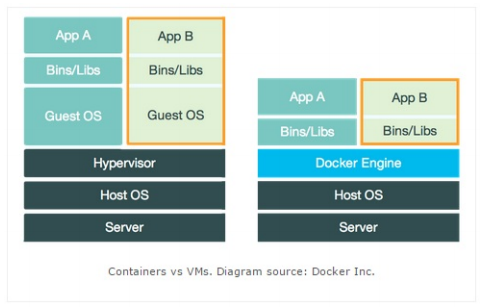
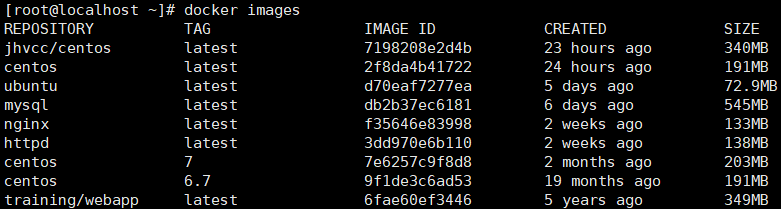

# Docker 学习

## 安装

首先确定电脑是否开启了虚拟化，如果没有开启。则按 F10（以惠普主板为例）进入`BIOS`系统，依次选择`Security->System Security->Virtualization Technology`将`disabled`改为`enabled`。F10 保存并退出系统。

如果`Windows 10`系统可以使用`Hyper V`来安装 Docker。如果是`Windows 10`或者其一下系统可以使用[`Docker Toolbox`](http://mirrors.aliyun.com/docker-toolbox/windows/docker-toolbox/)来安装 Docker。

推荐使用`Linux`学习 docker。

## Docker 架构


1. Docker daemon（Docker 守护进程）

   Docker daemon 是一个运行在宿主机（DOCKER_HOST）的后台进程。我们可以通过 Docker 客户端与之通信。

2. Client（Docker 客户端）

   Docker 客户端是 Docker 的用户界面，它可以接受用户命令和配置标识，并与 Docker daemon 通信。图中的 docker build 等都是 Docker 的相关命令。

3. Images（Docker 镜像）

   Docker 镜像是一个只读模板，它包含创建 Docker 容器的说明。她和系统安装光盘类似——我们使用系统安装光盘安装系统，同理，我们使用 Docker 镜像运行 Docker 镜像中的程序。

4. Container（容器）

   容器是镜像的可运行实例。镜像与容器的关系类似于面向对象中，类与对象的关系。我们可以通过 Docker API 或者 CLI 命令来启停、移动、删除容器。

5. Registry

   Docker Registry 是一个集中存储与分发镜像的服务。我们构建完 Docker 镜像后，就可以在宿主机上运行。总而言之 Docker Registry 就类似于一个仓库，仓库里面有许多的镜像可以使用。

   Docker Registry 可分为公有 Docker Registry 和私有 Docker Registry。最常用的莫过于官方的 Docker Hub，这也是默认的 Docker Registry。

## Docker 与虚拟机



- Hypervisor 层被 Docker Engine 取代。
  - [Hypervisor](https://baike.baidu.com/item/hypervisor/3353492)
- 虚拟化粒度不同
  - 虚拟机利用 Hypervisor 虚拟化 CPU、内存、IO 设备等实现的，然后在其上运行完整的操作系统，再在该系统上运行所需的应用。资源隔离级别：OS 级别。
  - 运行在 Docker 容器中的应用直接运行于宿主机的内核，容器共享宿主机的内核，容器内部运行的是 Linux 副本，没有自己的内核，直接使用物理机的硬件资源，因此 CPU/内存利用率上有一定优势。资源隔离级别：利用 Linux 内核本身支持的容器方式实现资源与环境隔离。
- 拓展阅读
  - [《Docker、LXC、Cgroup 的结构关系》](https://blog.51cto.com/speakingbaicai/1359825)
  - [Docker 真实应用场景](http://dockone.io/article/126)

## Docker 镜像常用命令

### 搜索镜像

可使用`docker search`命令搜索存放在 Docker Hub 中的镜像。

**命令格式**

```shell
docker search [options] TERM
```

**参数**

| Name, shorthand | Default |          Description           |
| :-------------: | :-----: | :----------------------------: |
|   --automated   |  false  |      只列出自动构建的镜像      |
|  --filter, -f   |         |      根据指定条件过滤结果      |
|     --limit     |   25    |       搜索结果的最大条数       |
|   --no-trunc    |  false  |   不截断输出，显示完整的输出   |
|   --stars, -s   |    0    | 只展示 Star 不低于该数值的结果 |

**示例**

```
docker search nginx
```

### 下载镜像

使用命令`docker pull`命令即可从 Docker Registry 上下载镜像。

**命令格式**

```shell
docker pull [OPTIONS] NAME[:TAG|@DIGEST]
```

**参数**

|    Name， shorthand     | Default |    Descrcption     |
| :---------------------: | :-----: | :----------------: |
|     --all-tags, -a      |  false  | 下载所有标签的镜像 |
| --disable-content-trust |  true   |   忽略镜像的校验   |

**示例**

```shell
docker pull nginx
```

执行该命令后，Docker 会从 Docker Hub 中的 nginx 仓库下载最新版本的 nginx 镜像。

```shell
docker jhvcc/centos:7
```

该命令还可以指定想要下载的镜像标签以及 Docker Registry 地址，这样可以从指定的 Docker Registry 中下载标签为 7 的 centos 镜像。

### 列出镜像

使用`docker images`命令即可列出已下载的镜像。

执行该命令后，将会看到类似于如下的内容：



①REPOSITORY：镜像所属仓库名称。

②TAG：镜像标签。默认是 latest，表示最新。

③IMAGE ID：镜像 ID，表示镜像唯一标识。

④CERATED：镜像创建时间。

⑤SIZE：镜像大小。

**命令格式**

```shell
docker images [OPTIONS] [REPOSITORY[:TAG]]
```

**参数**

| Name, shorthand | Default |                           Description                            |
| :-------------: | :-----: | :--------------------------------------------------------------: |
|    --all, -a    |  false  | 列出本地所有的镜像（含中间映像层，默认情况下，过滤掉中间映像层） |
|    --digests    |  false  |                           显示摘要信息                           |
|  --filter, -f   |         |                        显示满足条件的镜像                        |
|    --format     |         |                   通过 Go 语言模板文件展示镜像                   |
|   --no-trunc    |  false  |                  不截断输出，显示完整的镜像信息                  |
|   --quiet, -q   |  false  |                          只显示镜像 ID                           |

**示例**

```shell
docker images
docker images nginx
docker images centos:7
docker images --digests
docker images --filter "dangling=true"	# 展示虚悬镜像
```

### 删除本地镜像

使用`docker rmi`命令即可删除指定镜像。

**命令格式**

```
docker rmi [OPTIONS] IMAGES [IMAGE...]
```

**参数**

| Name，shorthand | Default |           Description            |
| :-------------: | :-----: | :------------------------------: |
|   --force, -f   |  false  |             强制删除             |
|   --no-prune    |  false  | 不移除该镜像的过程镜像，默认移除 |

**示例**

```shell
docker rmi hello-world
```

表示删除 hello-world 这个镜像。

```shell
docker rmi -f $(docker images)
```

删除所有镜像，-f 参数表示强制删除。

### 保存镜像

使用`docker save`即可保存镜像。

**命令格式**

```
docker save [OPTIONS] IMAGE [IMAGE...]
```

**参数**

| Name, shorthand | Default |            Description             |
| :-------------: | :-----: | :--------------------------------: |
|  --output, -o   |         | Write to a file, instead of STDOUT |

**示例**

```shell
docker save busybox > busybox.tar
docker save --output busybox.tar busybox
```

### 加载镜像

使用`docker load`命令即可加载镜像。

**命令格式**

```
docker load [OPTIONS]
```

**参数**

| Name, shorthand | Default |     Description      |
| :-------------: | :-----: | :------------------: |
|   --input, -i   |         | 从文件加载而非 STDIN |
|   --quiet, -q   |  false  |       静默加载       |

**示例**

```shell
docker load < busybox.tar.gz
docker load --input fedora.tar
```

### 构建镜像

通过 Dockerfile 构建镜像。

**命令格式**

```shell
docker build [OPTIONS] PATH | URL | -
```

**参数**

|     Name, shorthand     | Default |                        Description                        |
| :---------------------: | :-----: | :-------------------------------------------------------: |
|       --add-host        |         |     添加自定义从 host 到 IP 的映射，格式为（host:ip）     |
|       --build-arg       |         |                     设置构建时的变量                      |
|      --cache-from       |         |                     作为缓存源的镜像                      |
|     --cgroup-parent     |         |                    容器可选的父 cgroup                    |
|       --compress        |  false  |                 使用 gzip 压缩构建上下文                  |
|      --cpu-period       |    0    |       限制 CPU CFS（Completely Fair Scheduler）周期       |
|       --cpu-quota       |    0    |       限制 CPU CFS（Completely Fair Scheduler）配额       |
|    --cpu-shares, -c     |    0    |                 CPU 使用权重（相对权重）                  |
|      --cpuset-cpus      |         |                    指定允许执行的 CPU                     |
|      --cpuset-mems      |         |                    指定允许执行的内存                     |
| --disable-content-trust |  true   |                         忽略校验                          |
|       --file, -f        |         |      指定 Dockerfile 的名称，默认是'PATH/Dockerfile'      |
|       --force-rm        |  false  |                       删除中间容器                        |
|        --iidfile        |         |                   将镜像 ID 写到文件中                    |
|       --isolation       |         |                       容器隔离技术                        |
|         --label         |         |                   设置镜像使用的元数据                    |
|      --memory, -m       |    0    |                       设置内存限制                        |
|      --memory-swap      |    0    | 设置 Swap 的最大值为内存+swap，如果设置为-1 表示不限 swap |
|        --network        | default |             在构建期间设置 RUN 指令的网络模式             |
|       --no-cache        |  false  |                 构建镜像过程中不使用缓存                  |
|         --pull          |  false  |                总是尝试去更新镜像的新版本                 |
|       --quiet, -q       |  false  |             静默模式，构建成功后只输出镜像 ID             |
|          --rm           |  true   |                构建成功后立刻删除中间容器                 |
|     --security-opt      |         |                         安全选项                          |
|       --shm-size        |    0    |                 指定 /dev/shm 目录的大小                  |
|        --squash         |  false  |                将构建的层压缩成一个新的层                 |
|        --tag, -t        |         |            设置标签，格式：name:tag，tag 可选             |
|        --target         |         |                 设置构建时的目标构建阶段                  |
|        --ulimit         |         |                        Ulimit 选项                        |

**拓展阅读**

[Docker 命令](https://docs.docker.com/engine/reference/commandline/docker/)

## Docker 容器常用命令

### 新建并启动容器

使用`docker run`命令即可新建并启动一个容器。下面是一些常用的选项。

① -d 选项：表示后台运行

② -P 选项：随机端口映射

③ -p 选项：指定端口映射，有以下四种格式。

ip:hostPort:containerPort

ip::containerPort

hostPort:containerPort

containerPort

④ --network 选项：指定网络模式，该选项有以下可选参数：

--network=bridge：默认选项，表示连接到默认网桥。

--network=host：容器使用宿主机的网络。

--network=container:Name_or_ID：告诉 Docker 让新建的容器使用已有容器的网络配置。

--network=none：不配置该容器的网络，用户可自定义网络配置。

**示例**

```shell
docker run nginx /bin/echo 'Hello world'
```

这样终端会打印 Hello world 的字样，跟在本地直接执行`/bin/echo 'Hello world'`一样。

```
docker run -d -p 91:80 nginx
```

这样就能启动一个 Nginx 容器。访问http://Docker宿主机IP:91/，将会看到nginx的欢迎界面。

**TIPS**

需要注意的是，使用 docker run 命令创建容器时，会先检查本地是否存在指定镜像。如果本地不存在该名称的镜像，Docker 就会自动从 Docker Hub 上下载镜像并启动一个 Docker 容器。

### 列出容器

使用`docker ps`命令列出所有运行中的容器。


如需列出所有容器（包括已停止的容器），可使用 -a 参数。

①CONTAINER_ID：表示容器 ID。

②IMAGE：表示镜像名称。

③COMMAND：表示启动容器时运行的命令。

④CREATED：表示容器的创建时间。

⑤STATUS：表示容器运行的状态。Up 表示运行中，Exited 表示已停止。

⑥PORTS：表示容器对外的端口号。

⑦NAMES：表示容器名称。该名称默认由 Docker 自动生成，也可使用 docker run 命令的--name 选项自行指定。

**命令格式**

```
docker ps [OPTIONS]
```

**示例**

```
docker ps -n 5
docker ps -a
```

### 停止容器

使用`docker stop`命令，即可停止容器。

**命令格式**

```
docker stop [OPTIONS] CONTAINER [CONTAINER...]
```

**示例**

```
docker stop 784fd3b294d7
```

其中`784fd3b294d7`是容器 ID，当然也可以使用`docker stop 容器名称`来停止指定容器。

### 强制停止容器

可使用`docker kill`命令停止一个或更多运行着的容器。

**命令格式**

```
docker kill [OPTIONS] CONTAINER [CONTAINER...]
```

### 启动已停止的容器

使用`docker run`命令，即可新建并启动一个容器。对于已停止的容器，可使用`docker start`命令来启动。

**命令格式**

```
docker start [OPTIONS] CONTAINER [CONTAINER...]
```

### 重启容器

可使用`docker restart`命令重启容器。该命令实际上是先执行`docker stop`命令，再执行`docker start`命令。

**命令格式**

```
docker restart [OPTIONS] CONTAINER [CONTAINER...]
```

### 进入容器

某场景下，我们可能需要进入运行中的容器。

1. 使用`docker attach`命令进入容器。

   ```
   docker attach 784fd3b294d7
   ```

   很多场景下，使⽤`docker attach`命令并不⽅便。当多个窗⼝同时 attach 到同⼀个容器时，所有窗⼝ 都会同步显示。同理，如果某个窗⼝发⽣阻塞，其他窗⼝也⽆法执⾏操作。

2. 使用`docker exec`（建议）

   ```
   docker exec -it 容器id /bin/bash
   ```

### 删除容器

使用`docker rm`命令即可删除指定容器

**命令格式**

```
docker rm [OPTIONS] CONTAINER [CONTAINER...]
```

**示例**

```
docker rm 784fd3b294d7
```

该命令只能删除已停止的容器，如果需要删除正在运行的容器，可使用 -f 参数。

```
docker rm -f $(docker ps -a -q)
```

删除所有的容器。

### 导出容器

将容器导出成一个压缩包文件。

**命令格式**

```
docker export [OPTIONS] CONTAINER
```

**示例**

```
docker export red_panda > latest.tar
docker export --output="lastest.tar" red_panda
```

### 导入容器

使用`docker import`命令即可从归档文件导入内容并创建镜像。

**命令格式**

```
docker import [OPTIONS] file|URL|- [REPOSITORY[:TAG]]
```

**示例**

```
docker import nginx2.tar nginx
```

### 扩展阅读

- [Docker 的网络](https://docs.docker.com/network/)
- [Docker 命令](https://docs.docker.com/engine/reference/commandline/docker/)

## Docker 安装 Redis

```
docker run -itd --name redis-test -p 7396:6379 redis --requirepass "ZKSoft3"
```

## Docker 安装 MySQL

```
docker run -itd --name mysql-test -p 3306:3306 -e MYSQL_ROOT_PASSWORD=123456 mysql
```

本机可以通过以下命令访问 MySQL 服务

```
mysql -h localhost -u root -p
# 紧接着输入密码123456就行
```

远程连接只需要将上述的`localhost`改为远程 IP 地址就行。

## Docker 安装 Python

Docker 通过拉取 python 镜像会直接下载 pip、setuptools 和 wheel。

```
docker pull python:3.7
```

后续如果需要安装环境只需要将本机的 requirements.txt 发送到容器中，然后`pip install -r requirements.txt`就可以安装其他包。

## 修改记录

|  作者  | 描述 |    时间    |
| :----: | :--: | :--------: |
| lowell | 初稿 | 2020-11-23 |
